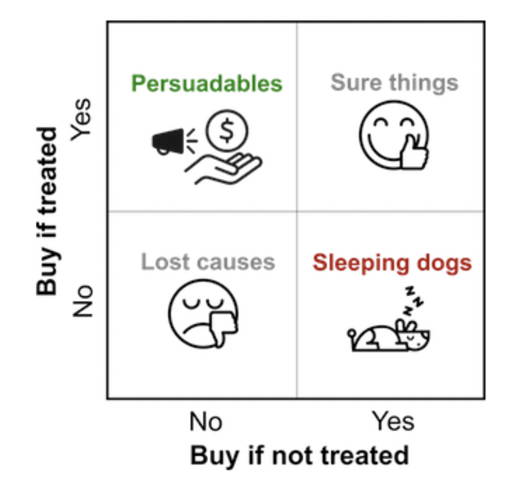
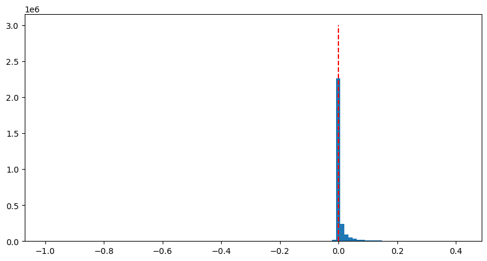
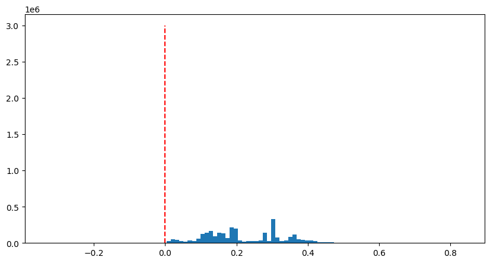
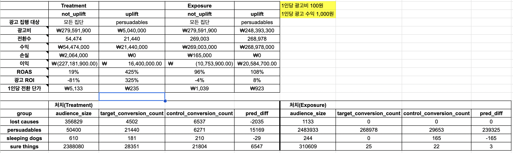

## Uplift Modeling Two Model Approaches

### 1. Uplift Modeling 소개
Uplift Modeling은 처치, 미처치에 따른 전환 여부를 개인 단위의 반응으로 예측합니다. 이에 따라 접근해야 하는 대상과 아닌 대상을 구분하는데 도움을 줍니다.

예를 들어, 광고를 진행하지 않을 때는 복귀하지 않지만, 광고를 진행할 때 복귀하는 Persuadables 를 찾아냅니다. 이를 통해 전체를 대상으로 광고를 집행할 때보다 Persuadables 를 대상으로 더 많은 수익을 기대할 수 있습니다.

Uplift Modeling에 사용된 [데이터](https://www.kaggle.com/datasets/arashnic/uplift-modeling)는 Kaggle을 활용했습니다.

### 2. Uplift Modeling Process
#### 2.1 전환 기준 설정
데이터 탐색 결과 전환은 Treatment와 Exposure, 그리고 전환은 Visit으로 설정했습니다.

#### 2.2 테스트 캠페인 집행
테스트 캠페인 집행에 앞서 Train(8) / Test(2) 데이터로 나누고, Train 데이터를 다시 1:1의 비율로 Target / Control 데이터를 분할합니다. 기존에 가지고 있는 데이터는 불균형이 발생해서 Resampling을 진행합니다.

#### 2.3 모델링
Train 데이터에 대해 탐색 및 전처리(연속형 변수 변환, 왜도, 스케일링)를 거치고, 전환(Visit)을 label로 설정해서 모델을 학습합니다. Two Model Approaches이기에 2개의 모델을 앞서 나눈 데이터로 학습합니다.

#### 2.4 실전 캠페인 적용 및 평가
test 데이터에 대해 각각의 모델을 이용하여 예측합니다. 두 모델의 predict_proba 차이를 uplift score로 정의합니다. 그리고, uplift score를 기준으로 4개의 그룹(Persuadables / Sure Things / Lost Causes / Sleeping Dogs)으로 구분합니다. 그리고 이를 토대로 처치 성과를 평가합니다.

총 4가지 과정을 거쳐서 진행합니다. Uplift Modeling Process에 대한 자세한 과정은 넥슨의 [업리프트 모델링을 통해 게임 광고 전환율 향상시키기](https://www.intelligencelabs.tech/5e047ef8-f811-47a8-9058-e6dfb2d5f8aa)을 참고하세요.

### 3. 처치 효율 비교
데이터 탐색 결과 처치(Treatment / Exposure)에 따른 전환(Visit) 결과를 살펴봅니다.

대부분의 데이터가 양의 값을 가집니다. 그래서 처치(Treatment)인 경우에 대해서는 전환(Visit)에 전반적으로 긍정적인 효과를 기대할 수 있습니다.

처치(Exposure)인 경우에 대해서는 전환(Visit)에 대부분이 긍정적인 효과를 기대할 수 있습니다. Treatment에 비해 긍정적으로 바라보는 유저들이 많습니다.

* 처치에 따른 최종 수익 - 처치(Treatment / Exposure) 2가지 모두에 대해 모든 집단이 아닌 Persuadables 집단에만 처치하는 것이 더 좋은 수익을 거두었다. 모든 집단에 대해서 처치할 경우에 오히려 손실이 발생했다. 2가지 처치(Treatment / Exposure)는 각각 16,400,000 / 20,584,700 의 수익이 발생했다.

* 처치 여부에 따른 광고 효율 비교 - 광고 효율을 나타내는 지표로 ROAS, 1인당 전환 단가, ROI가 있다. 처치(Treatment / Exposure) 2가지 모두에 대해 모든 집단이 아닌 Persuadables 집단에만 처치하는 것이 더 좋은 광고 효율이 발생했다.

* Treatment / Exposure 수익 및 효율 비교 - 데이터 탐색 시에 Treatment가 이뤄졌지만, Exposure에 따라 전환에 미치는 영향이 컸다. 처치를 Treatment가 아닌 Exposure에 대해서 진행할 경우에 약 400만원 가량의 수익이 더 발생했다. 그래서 기업은 Treatment가 이뤄져도 효과적인 노출(Exposure)가 이뤄지게끔 해야 더 많은 수익을 기대할 수 있다.
